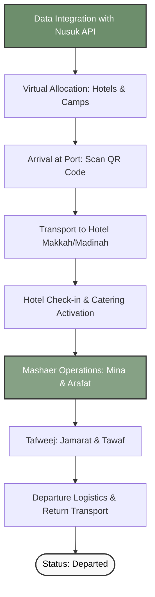

# Hajj Operations Management System
The Pilgrim's Journey: From Arrival to Departure

---

## 1. System Flowchart (مخطط انسياب العمليات)

erDiagram
    PILGRIM {
        string pilgrim_id
        string name
        string nationality
        string boundary_no
        string status
    }
    GROUP {
        string group_id
        string supervisor_name
        string nationality
        int total_pilgrims
    }
    ACCOMMODATION {
        string accommodation_id
        string type_Hotel_or_Camp
        string city_or_Mashaer
        int capacity
        string gps_location
    }
    TRANSPORT {
        string transport_id
        string plate_no
        string driver_name
        string driver_phone
        string route
    }
    CATERING {
        string catering_id
        string meal_type
        string delivery_time
        string contractor_name
        string status
    }

    GROUP ||--|{ PILGRIM : "contains"
    PILGRIM }|--|| ACCOMMODATION : "stays_at"
    GROUP }|--|| TRANSPORT : "uses"
    ACCOMMODATION ||--|{ CATERING : "receives"
